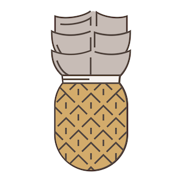

# YAPP 13기 6팀

## 과일 학당

**당신의 과일력을 높여줄 단 하나뿐인 학당**

---

### [App Store 링크](https://itunes.apple.com/kr/app/%EA%B3%BC%EC%9D%BC-%ED%95%99%EB%8B%B9/id1442496247?mt=8)

### 소개

과일에 관한 '알아두면 쓸모있는 상식'들을 쌓을 수 있는 과일 학당에 입학해보시는 것은 어떠신가요.

재밌는 과일 퀴즈들을 통해 당신의 과일력을 테스트 해보세요.

**과일 퀴즈**

과일에 관한 다양한 상식들을 퀴즈를 통해 학습하세요.

**과일 도감**

실생활에서 활용 가능한 과일 정보들을 손쉽게 접해보세요.

**3학년 등급제**

서당개에서 훈장님이 되는 그 날까지! 과일 퀴즈를 풀고, 다음 학년으로 진급하세요. 학년이 높아질수록 더 다양한 퀴즈들을 풀 수 있어요.

### 참여 인원

- 기획 | 13기 홍승혜
- 디자인 | 12기 장윤정
- 개발(Front-End) | 12기 박주현
- 개발(Front-End) | 12기 이한결
- 개발(Front-End) | 13기 김동환
- 개발(Front-End) | 13기 이재은
- 개발(Back-End) | 12기 이승연
- 개발(Back-End) | 13기 김다영

### 활용 기술: 디자인

- Adobe XD
- Adobe Illustrator
- Zeplin

### 활용 기술: 개발 (Front-End)

- iOS
- Realm
- SwiftLint
- SnapKit
- SVProgressHUD
- FSPagerView
- GaugeKit
- EFCountingLabel
- Kingfisher

### 활용 기술: 개발 (Back-End)

- Node.js
- Microsoft Azure vm
- MongoDB
- express.js
- Microsoft Azure Blob Storage
### 

